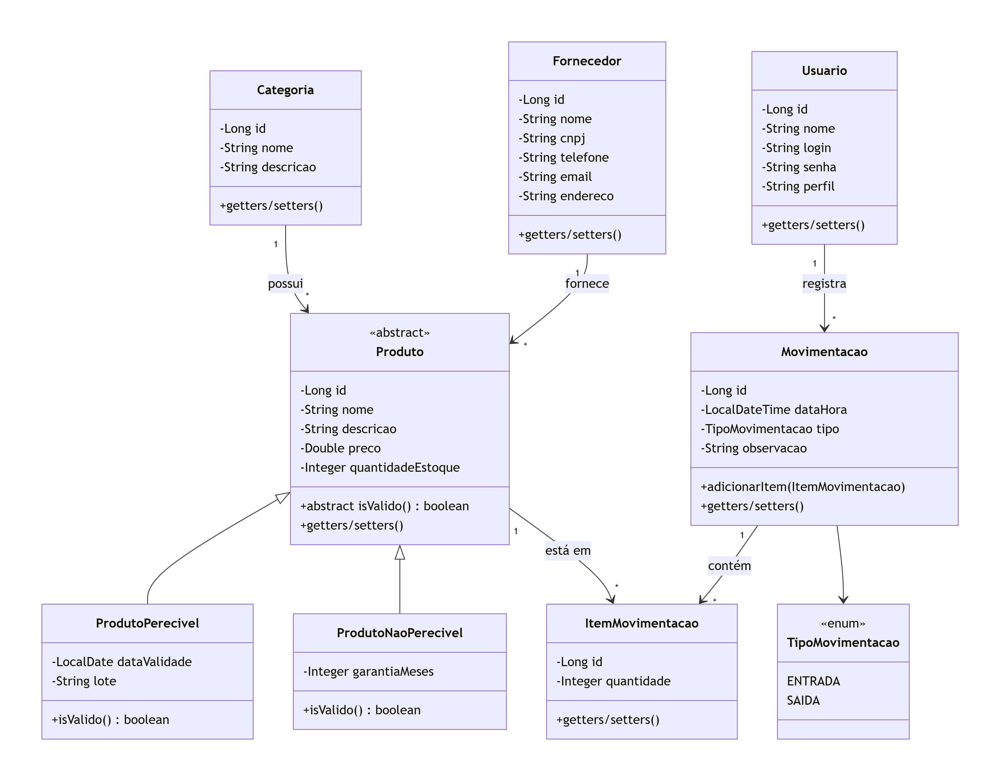

# Sistema de gerenciamento de estoque de Produtos

Repositório destinado à entrega do trabalho final na disciplina **"Arquiteturas Avançadas de Software com Microsserviços e Spring Framework [26E3_3]"**.

---

## Sobre o Projeto

Este projeto consiste no de sistema para o gerenciamento de estoque de um mercantil (comércio varejista de alimentos e produtos diversos).

A aplicação permite o controle completo de:

* Produtos;
* Categorias;
* Fornecedores;
* Usuários;
* Movimentações de estoque (entradas e saídas).

---

## Domínio da Aplicação

### Entidades principais

| Entidade                | Descrição                                                                                                      |
| ----------------------- | -------------------------------------------------------------------------------------------------------------- |
| **Categoria**           | Classifica os produtos (ex.: Bebidas, Limpeza, Padaria).                                                       |
| **Fornecedor**          | Empresa que abastece o mercantil com produtos.                                                                 |
| **Produto** (abstrata)  | Representa um item genérico, com nome, preço, quantidade em estoque, categoria e fornecedor.                   |
| **ProdutoPerecivel**    | Subclasse de Produto, com data de validade e lote. Possui validação específica (produto vencido não é válido). |
| **ProdutoNaoPerecivel** | Subclasse de Produto, com garantia em meses. Sempre válido.                                                    |
| **Usuario**             | Operador do sistema, com perfil (ADMIN, OPERADOR) para controle de acesso.                                     |
| **Movimentacao**        | Registro de uma entrada ou saída de produtos, contendo data/hora, tipo, usuário responsável e observação.      |
| **ItemMovimentacao**    | Detalhe de uma movimentação, associando um produto e a quantidade movimentada.                                 |

### Diagrama de Entidades

O diagrama abaixo ilustra o modelo de classes, com todos os relacionamentos e a hierarquia de herança:

### Relacionamentos (1:N)

* Uma `Categoria` pode ter vários `Produtos`.
* Um `Fornecedor` pode fornecer vários `Produtos`.
* Um `Usuario` pode registrar várias `Movimentacoes`.
* Uma `Movimentacao` pode conter vários `ItensMovimentacao`.
* Um `Produto` pode aparecer em vários `ItensMovimentacao`.

---

## Tecnologias Utilizadas

* **Java 21**
* **Spring Boot 3.3.4**
* **Spring Web** – construção da API REST
* **Spring Data JPA** – persistência de dados
* **H2 Database** – banco de dados em memória para desenvolvimento/testes
* **Bean Validation** – validação de dados de entrada
* **SpringDoc OpenAPI (Swagger UI)** – documentação interativa
* **Maven** – gerenciamento de dependências
